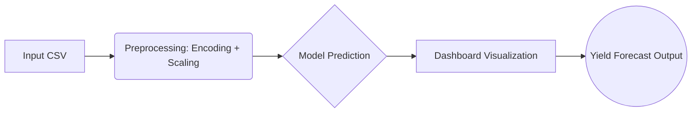

# 🌾 Intelligent Crop Yield Prediction System

[](https://abhiiiiiii-21-crop-yield-prediction-model-appapp-xywyvd.streamlit.app/)
[](https://www.python.org/)
[](https://scikit-learn.org/)
[](https://pandas.pydata.org/)
[](https://numpy.org/)

> A machine learning-powered application designed to predict agricultural crop yield using historical data, modeled as a supervised regression problem.

---

## 📖 Overview

Agricultural productivity plays a crucial role in economic stability and food security. The **Intelligent Crop Yield Prediction System** provides an interactive dashboard for analysis and inference, helping to predict crop yield based on agricultural features.

### ✨ Key Features
- **End-to-end ML pipeline implementation**
- **Feature engineering & target leakage prevention**
- **Model evaluation & selection**
- **Inference pipeline design**
- **Interactive web deployment using Streamlit**

---

## 🎯 Problem Statement

Crop yield prediction enables:
- 📊 Strategic resource allocation
- 🧪 Fertilizer optimization
- 🛡️ Risk mitigation
- 💰 Revenue forecasting
- 📋 Policy planning

**The Objective:** Design and deploy a machine learning system capable of predicting crop yield based on agricultural features.

**The Model Formulation:** `ŷ = f(X)`
- `X` = Feature matrix (Crop, State, Season, Area, etc.)
- `ŷ` = Predicted Yield

---

## 📊 Dataset Description

- **Total Observations:** ~19,700
- **Total Features:** 10 columns
- **Target Variable:** Yield (continuous numerical variable)
- **Missing Values:** None

### Feature Dictionary
| Feature | Description |
|---|---|
| `Crop` | Type of crop |
| `State` | Indian state where the crop is grown |
| `Season` | Growing season |
| `Area` | Area under cultivation |
| `Production` | *(Removed to prevent target leakage)* |
| `Yield` | **Target variable** |

---

## 🛠️ Feature Engineering & Preprocessing

### 🚫 Target Leakage Prevention
The `Production` column was deliberately removed. Since `Yield = Production / Area`, including it would introduce direct mathematical data leakage.

### 🔠 Categorical Encoding
Applied **One-Hot Encoding** (`pd.get_dummies(drop_first=True)`) to:
- `Crop`
- `Season`
- `State`

### 📏 Feature Scaling
Applied **StandardScaler** (`z = (x − μ) / σ`). The scaler was fit *only* on the training data to prevent data leakage into the test set.

---

## 🧠 Methodology & Model Performance

### Train-Test Split
- **Training Set:** 80%
- **Testing Set:** 20%
- **Random State:** 42

### Models Implemented
1. **Linear Regression** (Baseline)
2. **Decision Tree Regressor** (Final Model)
   - `max_depth` = 8
   - `random_state` = 42

### 🏆 Final Model Evaluation (Decision Tree)

| Metric | Value |
|--------|-------|
| **Train R²** | `0.989` |
| **Test R²** | `0.973` |
| **MAE** | `10.47` |
| **RMSE** | `147.379` |
| **Adjusted R²** | `0.9636` |

**Interpretation:**
- High test R² indicates **strong generalization**.
- Small train-test gap suggests **very limited overfitting**.
- Decision Tree drastically outperformed Linear Regression, capturing non-linear agricultural relationships effectively.

---

## ⚙️ Inference Pipeline

**Project Artifacts Saved:**
- `artifacts/best_model.pkl`
- `artifacts/scaler.pkl`
- `artifacts/feature_columns.pkl`

**Prediction Workflow:**
1. Load trained model & artifacts.
2. Apply identical preprocessing to new input data.
3. Align feature schema.
4. Apply standard scaling.
5. Generate yield prediction.

---

## 🏗️ System Architecture



**The system dashboard supports:**
- Default dataset analysis and visualization
- Custom CSV uploads for batch inference
- KPI reporting
- Feature importance plotting

---

## 🚀 Deployment

The model is deployed and fully accessible via an interactive web dashboard.

🔗 **Live Application:** [Streamlit App](https://abhiiiiiii-21-crop-yield-prediction-model-appapp-xywyvd.streamlit.app/)

---

## 📂 Project Structure

```text
crop-yield-prediction-model/
│
├── app/
│   └── app.py                  # Streamlit frontend application
│
├── src/
│   ├── model_pipeline.py       # Training, evaluation & inference logic
│   └── data_preprocessing.py   # Data cleaning & feature engineering
│
├── data/
│   └── crop_yield.csv          # Raw agricultural dataset
│
├── artifacts/                  # Saved models & scalers (ignored in Git)
│
├── .streamlit/
│   └── config.toml             # Streamlit configuration
│
├── requirements.txt            # Project dependencies
├── README.md                   # Project documentation
└── .gitignore                  # Git untracked files
```

---

## 💻 Technologies Used

- **Python** 🐍
- **Pandas & NumPy** 📊
- **Scikit-learn** 🤖
- **Streamlit** 🌐
- **Plotly** 📈

---

## 🏁 Conclusion

The Intelligent Crop Yield Prediction System successfully:
- Prevents target leakage
- Implements robust preprocessing
- Evaluates multiple regression models
- Selects the optimal model based on performance metrics
- Deploys via an interactive dashboard

*The Decision Tree Regressor demonstrated superior capability in capturing non-linear agricultural relationships.*
