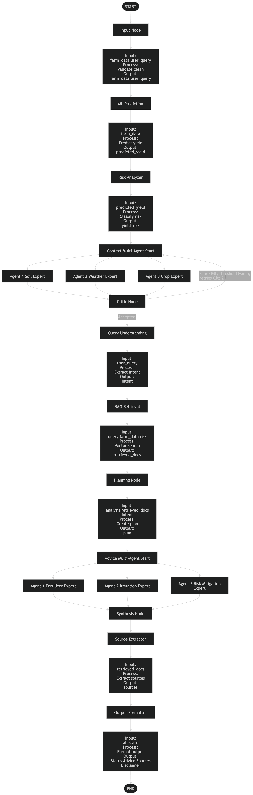
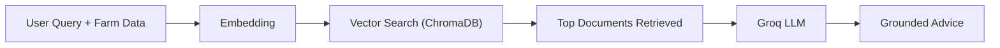
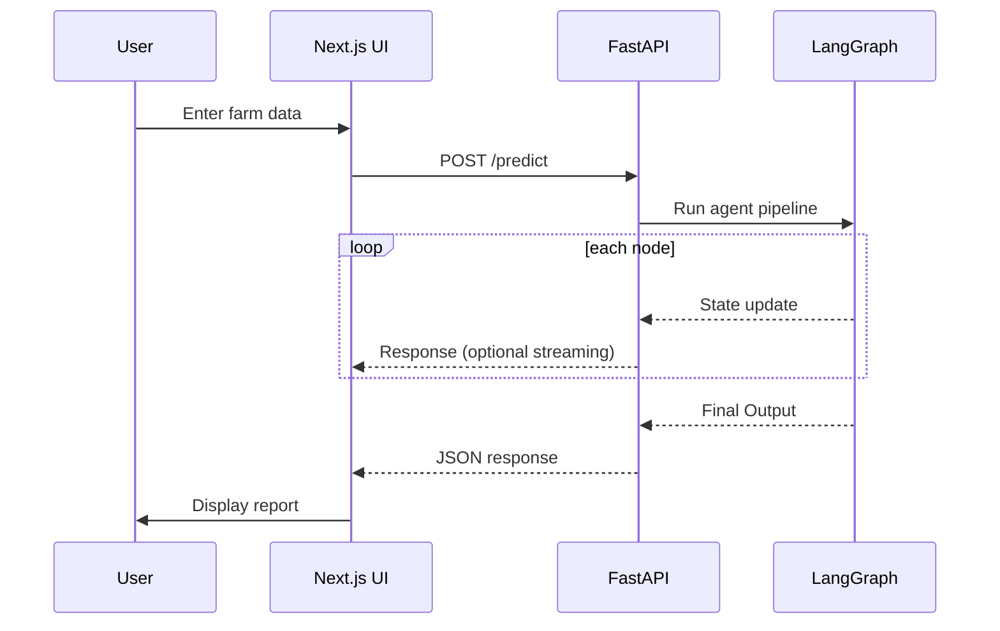

<div align="center">

# Crop Advisory AI

**An Agentic AI system that predicts crop yield and generates intelligent farming recommendations.**

Farm Data → ML Prediction → Multi-Agent Analysis → RAG → AI Advice → Final Report

[Overview](#overview) · [Architecture](#architecture) · [Graph](#the-graph) · [RAG](#rag-layer) · [UI Flow](#ui--data-flow) · [Stack](#tech-stack) · [Setup](#setup)

</div>

---

## Overview

Crop Advisory AI is a full-stack intelligent system that helps farmers make better decisions by predicting crop yield and providing actionable recommendations.

The system combines:

* **Machine Learning** for yield prediction
* **LangGraph** for multi-agent orchestration
* **Groq LLM** for reasoning and advice generation
* **RAG (Retrieval-Augmented Generation)** for grounded recommendations
* **Next.js frontend + FastAPI backend**

The pipeline processes structured farm data and user queries, then uses multiple specialized AI agents to analyze conditions and generate a final advisory report.

---

### 🔍 What makes this system unique

* **Hybrid ML + LLM pipeline** (prediction + reasoning)
* **Multi-agent architecture** (soil, weather, crop experts)
* **Critic loop** for improved reasoning quality
* **RAG grounding** using agricultural knowledge
* **Structured UI-ready output**

---

## Architecture

<details>
<summary><b>Click to expand Architecture Diagram</b></summary>

<p align="center">
  
</p>

</details>

---

## The Graph

Entry: `Input Node`
Exit: `Output Formatter → Final Output`

The system is built using a **LangGraph workflow**, where each node performs a specific task and updates a shared state.

---

### 🔹 Core Pipeline

1. **Input Node**

   * Accepts farm data + user query
   * Validates and cleans input

2. **ML Node**

   * Predicts crop yield using trained model

3. **Risk Node**

   * Classifies yield risk (LOW / MEDIUM / HIGH)

---

### 🔹 Context Multi-Agent System

Parallel agents:

* Soil Agent → analyzes soil conditions
* Weather Agent → analyzes environmental impact
* Crop Agent → analyzes crop suitability

All outputs are evaluated by:

* Critic Node → scores analysis
* Retry loop if score is low

---

### 🔹 Intelligence Layer

4. **Query Understanding**

   * Extracts user intent

5. **RAG Node**

   * Retrieves relevant agricultural knowledge

6. **Planning Node**

   * Generates strategy based on:

     * agent analysis
     * retrieved knowledge
     * risk level

---

### 🔹 Advice Multi-Agent System

Parallel agents:

* Fertilizer Agent
* Irrigation Agent
* Risk Mitigation Agent

---

### 🔹 Finalization

7. **Synthesis Node**

   * Combines all advice into concise recommendations

8. **Source Extractor**

   * Extracts knowledge references

9. **Output Formatter**

   * Produces final structured output

---

## RAG Layer

The system uses a **ChromaDB-based vector database** to retrieve relevant agricultural knowledge.

---

### 🔹 Process



---

### 🔹 Benefits

* Prevents hallucination
* Improves accuracy
* Provides source-backed recommendations

---

## UI & Data Flow



---

## Tech Stack

| Layer     | Stack                                |
| --------- | ------------------------------------ |
| Frontend  | Next.js, Tailwind CSS, Framer Motion |
| Backend   | FastAPI, LangGraph                   |
| LLM       | Groq (Llama 3.1)                     |
| ML        | scikit-learn                         |
| Data      | Pandas, NumPy                        |
| RAG       | ChromaDB                             |
| Utilities | python-dotenv                        |

---

## Setup

<details>
<summary><b>Local Setup</b></summary>

```bash
# Backend
cd backend
python -m venv .venv && source .venv/bin/activate
pip install -r requirements.txt
python -m uvicorn app.api:app --reload

# Frontend
cd frontend
npm install
npm run dev
```

---

### Environment Variables

Create `.env` in backend:

```
GROQ_API_KEY=your_api_key
```

---

### Access

* Backend → python -m uvicorn app.api:app --reload
* Frontend → npm run dev

</details>

---

## Final Output Example

```json
{
  "Status": "Crop: Wheat\nPredicted Yield: 1.56\nRisk Level: MEDIUM",
  "Advice": "✔ Conduct soil testing\n✔ Adjust fertilizer\n✔ Maintain irrigation\n✔ Monitor crop health\n✔ Optimize soil pH",
  "Sources": ["AgriDocs-Wheat", "Soil Health Guidelines"],
  "Disclaimer": "AI-generated advisory"
}
```

---

## Advantages

* Combines ML + AI reasoning
* Scalable multi-agent system
* Real-time decision support
* Explainable output

---

## Limitations

* Depends on input quality
* LLM responses may vary
* Requires internet for API

---

## Future Scope

* Real-time weather API integration
* Mobile app for farmers
* IoT sensor integration
* Multilingual support

---

## Conclusion

This project demonstrates how **Agentic AI systems** can transform agriculture by combining prediction, reasoning, and knowledge retrieval into a unified intelligent pipeline.

---
